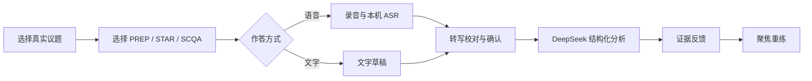
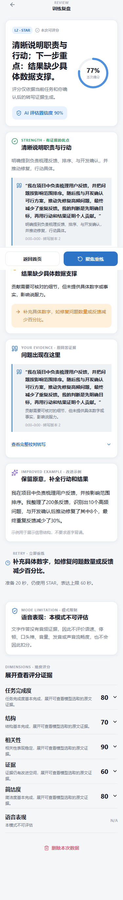

# 言序 · YANXU Express

> 把“我大概知道怎么说”，练成“我能清楚地说出来”。

言序是一款面向大学生与初入职场人群的 AI 表达训练应用。选择一道真实议题，用 PREP、STAR 等框架组织思路，通过语音或文字完成一次短练习；系统会基于用户确认后的回答，给出带原文证据的优势、优先改进建议和聚焦重练任务。

<p>
  
  
  
  
  
  
</p>

<p align="center">
  
</p>

## 不只给一个分数，而是告诉你下一次怎么说

| 能力 | 当前实现 |
| --- | --- |
| 真实场景题库 | 80 道训练议题，覆盖生活讨论、经典辩论、社会议题、校园成长、求职职场与写作迁移 6 类场景 |
| 双模式作答 | 语音输入与文字输入进入同一套任务、校对、评分和重练闭环 |
| 结构化准备 | 支持 PREP、STAR、SCQA 等方法，把零散想法装进可表达的结构 |
| 证据型反馈 | 优点与建议绑定真实回答片段，而不是只生成泛泛点评 |
| 聚焦重练 | 每次优先处理一个最值得改进的问题，并给出可立即执行的重练目标 |
| 可靠失败语义 | 技术故障、证据不足或识别失败不会被误算成表达低分，也不会污染成长记录 |
| 双主题界面 | 支持白色浅色与淡黄莫兰迪主题，主页、准备、作答和复盘保持一致 |

## 一次训练如何完成



- 语音模式：录音 → 本地 Faster-Whisper 转写 → 用户校对 → AI 分析。
- 文字模式：草稿 → 内容校验 → 用户确认 → 同一套 AI 分析。
- 文字作答不会虚构语速、停顿、口头禅或发音数据；没有音频证据的维度明确显示“本模式不可评估”。

## 界面预览

### 先准备，再表达

<p align="center">
  
</p>

### 从训练进度到证据反馈

<table>
  <tr>
    <td align="center"><strong>训练完成与成长进度</strong></td>
    <td align="center"><strong>带原文证据的 AI 反馈</strong></td>
  </tr>
  <tr>
    <td align="center"></td>
    <td align="center"></td>
  </tr>
</table>

## 四层训练体系

| 层级 | 核心能力 | 典型训练 |
| --- | --- | --- |
| L1 精准复述 | 抓住关键信息，减少遗漏和失真 | READ → REPEAT → SUMMARY，最后用不超过 30 字压缩 |
| L2 逻辑框架 | 先结论、后依据，让表达更容易跟随 | PREP、STAR、SCQA 结构化回答 |
| L3 情境回应 | 在真实关系与目标约束中说清下一步 | 拒绝、澄清、发声、回应与连续追问 |
| L4 即兴表达 | 快速形成观点，并根据新信息调整 | 观点议题、关键词模式、经典辩题与社会讨论 |

题库由结构化研究数据生成，并保留来源编号、安全提示、时效与更新标记：

- 80 道训练题；
- 28 个表达与训练方法；
- 97 条研究来源；
- 可执行 `npm run sync:topics` 校验并重新生成前后端共享快照。

## 隐私与可靠性

- 原始录音默认只交给本机或部署服务器上的 Faster-Whisper，不发送给 DeepSeek。
- 只有用户确认后的转写、当前题目和评分标准会发送到 `https://api.deepseek.com`。
- API Key 只从服务端环境变量读取，不进入前端包，也不提交到 Git。
- 录音权限拒绝、空文本、文本过短、上传失败、ASR 失败和评分失败都有独立恢复状态。
- 技术失败不计分、不消耗有效练习次数，也不更新成长进度。
- 支持删除单次训练数据与重置本机演示数据。

> DeepSeek 评分是训练建议，不是对人格、智力、心理状态或就业能力的判断。

## 快速开始

### 环境要求

- Windows 10/11；
- Node.js 20 或更高版本；
- npm；
- Python 3.10+（仅在启用本地语音识别时需要）；
- DeepSeek API Key（启用真实 AI 分析时需要）。

### 1. 获取项目并安装依赖

```powershell
git clone git@github.com:Cloud-Mars-ai/expression-training-app.git
cd expression-training-app
npm ci
Copy-Item .env.example .env.local
```

编辑 `.env.local`，至少配置：

```dotenv
EVALUATION_PROVIDER=deepseek
DEEPSEEK_BASE_URL=https://api.deepseek.com
DEEPSEEK_MODEL=deepseek-chat
DEEPSEEK_API_KEY=你的服务端密钥
```

### 2. 可选：准备本地 Faster-Whisper

```powershell
python -m venv .runtime\asr-venv
.\.runtime\asr-venv\Scripts\python.exe -m pip install -r deploy\asr-requirements.txt
.\.runtime\asr-venv\Scripts\python.exe server\asr\download_model.py
```

默认使用 `small` 模型、CPU 和 `int8` 推理。首次下载需要较长时间和稳定网络。

### 3. 启动完整应用

```powershell
.\start-full-stack.ps1
```

脚本会自动选择可用端口并打开首页。也可以直接双击 `启动试用版.bat`。

## 常用开发命令

```powershell
npm run lint:frontend
npm run typecheck:contracts
npm run typecheck:server
npm run test:frontend
npm run test:server
npm run build:frontend
```

真实 DeepSeek 连通性测试会产生外部 API 请求，仅在已配置密钥并确认费用后运行：

```powershell
npm run verify:deepseek
```

## 技术栈

- 前端：React、TypeScript、Vite、React Router、Tailwind CSS、Lucide React；
- 后端：Fastify、TypeScript、Zod；
- 数据：SQLite、Drizzle ORM；
- 语音：Faster-Whisper、FastAPI；
- AI 分析：DeepSeek OpenAI-compatible API；
- 测试：Vitest、Testing Library、Playwright Core；
- 部署：Nginx、systemd、Let's Encrypt、Ubuntu。

## 项目结构

```text
frontend/           React 前端与移动端响应式页面
server/             Attempt、上传、转写、评分与数据持久化
contracts/          前后端共享领域模型与 API 契约
scripts/            研究题库同步与校验脚本
deploy/             Ubuntu、Nginx、systemd 与 ASR 部署配置
docs/screenshots/   README 使用的真实应用截图
app/                已构建的网页演示成品
```

## 当前阶段

这是一个可运行的试用版本，已经打通文字训练闭环、真实录音上传、本地 ASR、转写校对、DeepSeek 证据反馈、结果复盘和聚焦重练。下一阶段重点是继续校准评分标准、扩充专家标注样本，并验证训练前后在不同题目上的真实迁移效果。

---

如果这个方向也困扰过你，欢迎提交 Issue，分享一个“知道自己想说什么，却总是说不清楚”的真实场景。
